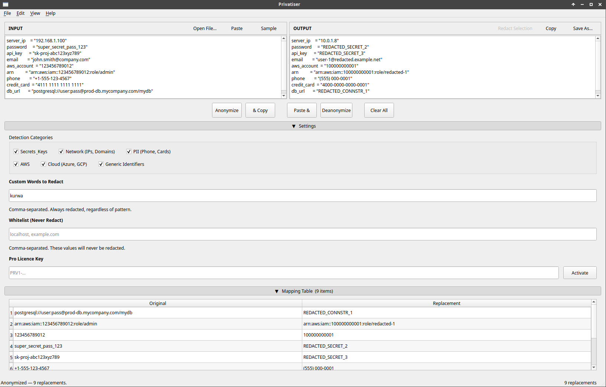
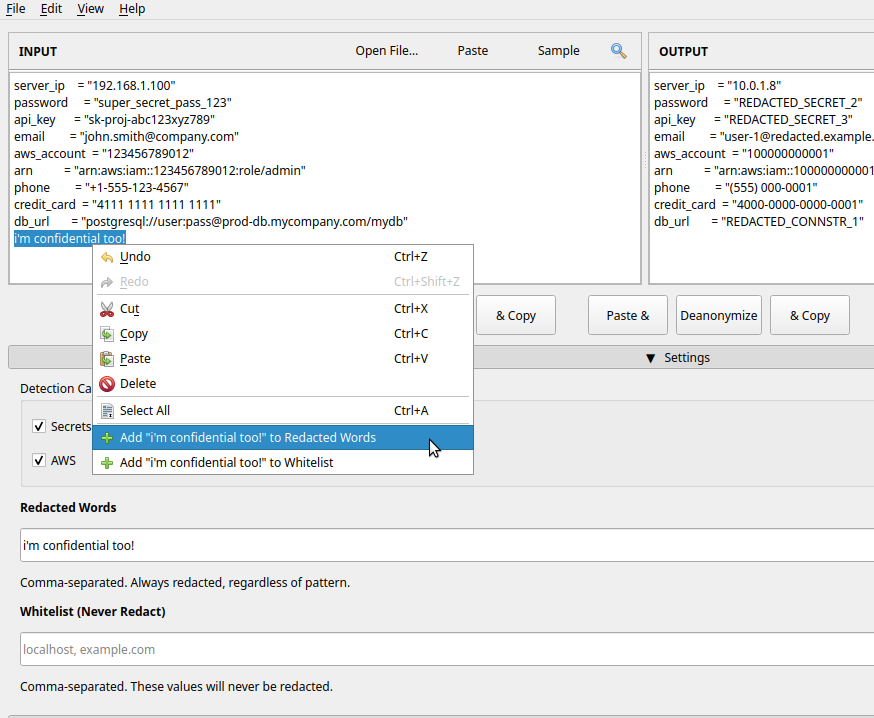

# Privatiser

Desktop GUI for anonymizing sensitive text — replaces IPs, API keys, secrets, PII, and cloud identifiers with structurally valid pseudonyms, fully reversible, everything runs locally.



Something slipped? Right-click any selection in the input pane to add it to Custom Words instantly:



## Running from source

### Ubuntu 24.04+

```bash
sudo apt install python3-pyqt6

git clone https://github.com/gdr-aislop/privatiser-qt6.git
cd privatiser-qt6

python3 -m venv .venv --system-site-packages
source .venv/bin/activate
pip install privatiser

python3 main.py
```

> `--system-site-packages` lets the venv use the system `python3-pyqt6` so you don't need to pip-install PyQt6 separately.

### Fedora 40+

```bash
sudo dnf install python3-PyQt6

git clone https://github.com/gdr-aislop/privatiser-qt6.git
cd privatiser-qt6

python3 -m venv .venv --system-site-packages
source .venv/bin/activate
pip install privatiser

python3 main.py
```

## Pre-built packages

`.deb` packages for Ubuntu 24.04 are built automatically by CI:

- **Tagged releases** — [GitHub Releases](https://github.com/gdr-aislop/privatiser-qt6/releases) — pick the `.deb` from the release assets
- **Every commit** — [GitHub Actions](https://github.com/gdr-aislop/privatiser-qt6/actions) → latest run → *privatiser-deb-ubuntu2404* artifact (kept for 30 days)

Install with:

```bash
sudo apt install python3-pyqt6
sudo dpkg -i privatiser_*_all.deb
```
